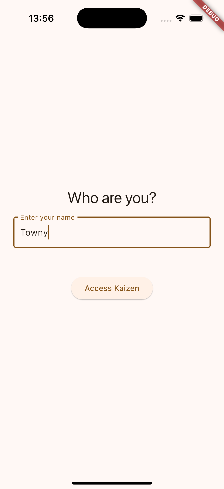
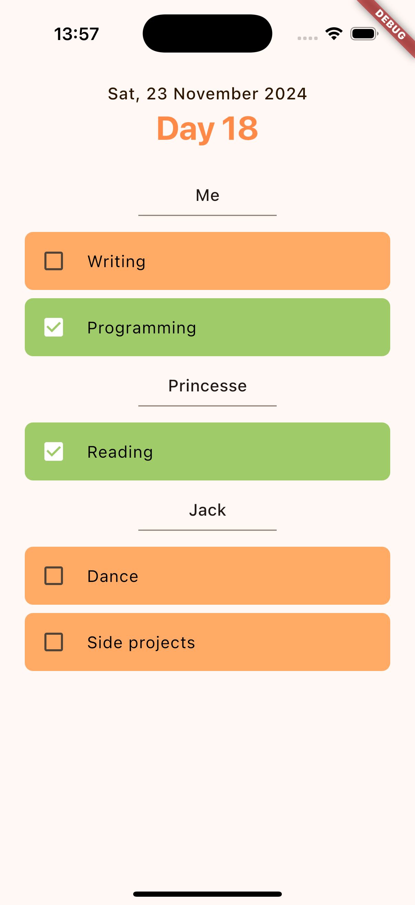

# Kaizen 📆🎯

Welcome to **Kaizen**, your **Daily Challenge App**, a Flutter application designed to let you create daily challenges with your friends and track their progress in real-time! 🚀

This project is both a fun tool to boost your routines and a great way to bound with your friends. It incorporates modern practices, robust architectures, and smart use of libraries and services to deliver a smooth and efficient user experience.

<br>

## ✨ Features

- **Create daily challenges**: Set up a challenge for you and your friends.
- **Real-time tracking**: Check if your friends have completed their daily challenge.
- **Notifications** (TODO): Receive reminders for your ongoing challenges and be notified when your friend is about to fail!.

<br>

## 🎥 Preview

<div style="text-align: center;">
  
  
</div>

<br>

## 🛠️ Technologies and Architecture

Daily Challenge App is built with modern tools and proven concepts to ensure maintainability, performance, and scalability:

### Framework and Language

- **Flutter** (Dart): A powerful cross-platform framework.

### Libraries and Tools

- **Riverpod**: Reactive and robust state management with new providers library.
- **Sembast**: Lightweight and fast local database.
- **Firebase Firestore**: Cloud database for real-time storage.
- **Firebase Cloud Functions**: Server-side logic without infrastructure management.
- **Streams**: Efficient management of asynchronous data flows and real-time updates.

### Architecture

The project follows **Clean Architecture** principles for clear separation of concerns:

- **Presentation Layer**: Flutter widgets and UI logic (state providers).
- **Domain Layer**: Use cases and business rules.
- **Data Layer**: Repositories and data sources (Firestore, Sembast).

<br>

## 🤝 Contributing

Contributions are welcome! If you have an idea, improvement, or bug fix, feel free to:

1. **Fork the project**.
2. **Create a new branch for your changes**:
   ```
   git checkout -b feature/feature-name
   ```
4. **Submit a Pull Request**.

Thank you for your help! 🙌
